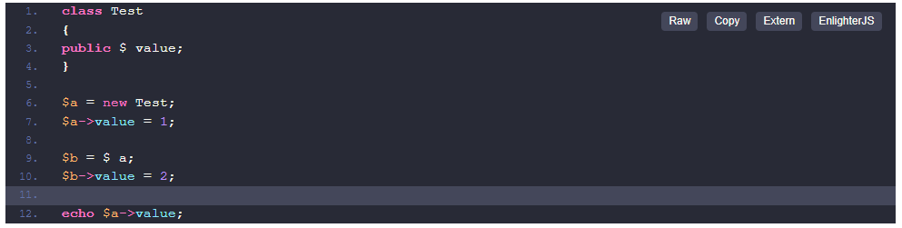
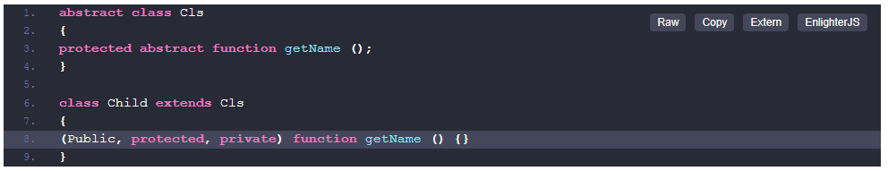
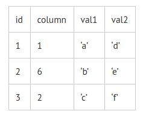

  # Middle
  ## Общие вопросы

  1. [Как передаются переменные (по значению или по ссылке)?](https://codernet.ru/articles/web/kak_opredelit_peremennyie_php_peredayutsya_po_znacheniyu_ili_po_ssyilke/)
  2. [Какие процессы происходят, когда пользователь вводит в браузере URL?](https://habr.com/ru/company/karuna/blog/568702/)
  3. [Что такое вариативная функция или splat-оператор?](https://sobes.sr-studio.com.ua/middle/question/cto-takoe-variativnaya-funkciya-ili-splat-operator)
  4. [Что такое OWASP?](https://sobes.sr-studio.com.ua/middle/question/cto-takoe-owasp)
  5. [Какие типы уязвимостей знаете? Как от них защищаться?](https://docs.wallarm.ru/attacks-vulns-list/#%D0%B8%D0%B7%D1%83%D1%87%D0%B5%D0%BD%D0%B8%D0%B5-%D1%80%D0%B5%D1%81%D1%83%D1%80%D1%81%D0%B0-%D1%81%D1%82%D0%BE%D1%80%D0%BE%D0%BD%D0%BD%D0%B8%D0%BC-%D1%81%D0%BA%D0%B0%D0%BD%D0%B5%D1%80%D0%BE%D0%BC)
  6. [Что такое идемпотентные методы? Какие HTTP-методы являются идемпотентными для REST?](https://russianblogs.com/article/59751003979/)
  7. [Что такое stateless?](https://medium.com/@ermakovichdmitriy/%D0%BE%D0%BF%D1%80%D0%B5%D0%B4%D0%B5%D0%BB%D0%B5%D0%BD%D0%B8%D1%8F-%D0%BF%D0%BE%D0%BD%D1%8F%D1%82%D0%B8%D0%B9-stateful-%D0%B8-stateless-%D0%B2-%D0%BA%D0%BE%D0%BD%D1%82%D0%B5%D0%BA%D1%81%D1%82%D0%B5-%D0%B2%D0%B5%D0%B1-%D1%81%D0%B5%D1%80%D0%B2%D0%B8%D1%81%D0%BE%D0%B2-%D0%BF%D0%B5%D1%80%D0%B5%D0%B2%D0%BE%D0%B4-18a910a226a1)
  8. [SOAP vs REST. В чем разница?](https://otus.ru/nest/post/2427/)
  9. [Какие методы авторизации используют для построения API?](https://russianblogs.com/article/93541002263/)
  10. [Что может содержать интерфейс?](https://habr.com/ru/post/328890/)
  11. [Класс содержит свойство, которое, в свою очередь, является объектом. Что будет содержать это свойство в клонированном объекте: ссылку на тот же дочерний объект или копию дочернего объекта? Что нужно сделать, чтобы это изменить?](https://www.php.net/manual/ru/language.oop5.cloning.php)
  12. [Что такое Mock? Где используют и зачем?](https://habr.com/ru/post/577424/)
  13. [Что такое PSR?](https://habr.com/ru/post/458484/)
  14. [Опишите реализацию одного из шаблонов проектирования.](https://refactoring.guru/ru/design-patterns)
  15. [Что такое Redis?](https://aws.amazon.com/ru/redis/)
  16. [Как хранятся данные в Redis / Memcached?](https://habr.com/ru/company/oleg-bunin/blog/316652/)
  17. [Расскажите о целесообразности применения Redis / Memcached для кэширования. Каковы плюсы и минусы?](https://cityhost.ua/blog/servisy-keshirovaniya-dlya-saytov-memcached-opcache-redis.html)
  18. [Назовите различия между nginx и Apache.](https://ekaterinagoltsova.github.io/posts/apache-vs-nginx/)
  19. [Что такое Opcash? Как он работает?](https://medium.com/@geroi.minsk/%D0%BE%D0%B1%D0%B7%D0%BE%D1%80-%D1%80%D0%B0%D1%81%D1%88%D0%B8%D1%80%D0%B5%D0%BD%D0%B8%D1%8F-opcache-%D0%B4%D0%BB%D1%8F-php-from-mail-ru-group-9ae3c49577bb)
  20. [Что такое JIT? Как он работает?](https://www.tremplin-numerique.org/ru/quest-ce-que-la-compilation-juste-a-temps-jit)
  21. [Зачем нужно ключевое слово final?](https://www.php.net/manual/ru/language.oop5.final.php#:~:text=PHP%20%D0%BF%D1%80%D0%B5%D0%B4%D0%BE%D1%81%D1%82%D0%B0%D0%B2%D0%BB%D1%8F%D0%B5%D1%82%20%D0%BA%D0%BB%D1%8E%D1%87%D0%B5%D0%B2%D0%BE%D0%B5%20%D1%81%D0%BB%D0%BE%D0%B2%D0%BE%20final,%D0%BE%D0%BD%20%D0%BD%D0%B5%20%D1%81%D0%BC%D0%BE%D0%B6%D0%B5%D1%82%20%D0%B1%D1%8B%D1%82%D1%8C%20%D1%83%D0%BD%D0%B0%D1%81%D0%BB%D0%B5%D0%B4%D0%BE%D0%B2%D0%B0%D0%BD.)
  22. [Что нового в РНР 7/8?](https://otus.ru/journal/php-8-chto-novogo/)
  23. [Что такое SOLID, DRY, KISS, YAGNI?](https://techrocks.ru/2020/01/01/10-coding-principles-demystified/)
  24. Назовите паттерны проектирования, с которыми приходилось работать.
  25. [Что такое простая фабрика?](https://refactoring.guru/ru/design-patterns/factory-comparison#:~:text=%D0%9F%D0%B0%D1%82%D1%82%D0%B5%D1%80%D0%BD%20%D0%9F%D1%80%D0%BE%D1%81%D1%82%D0%B0%D1%8F%20%D1%84%D0%B0%D0%B1%D1%80%D0%B8%D0%BA%D0%B0-,%D0%9F%D0%B0%D1%82%D1%82%D0%B5%D1%80%D0%BD%20%D0%9F%D1%80%D0%BE%D1%81%D1%82%D0%B0%D1%8F%20%D1%84%D0%B0%D0%B1%D1%80%D0%B8%D0%BA%D0%B0,%D1%84%D0%B0%D0%B1%D1%80%D0%B8%D0%BA%D0%B8%2C%20%D0%BE%D0%B1%D1%8B%D1%87%D0%BD%D0%BE%2C%20%D0%BD%D0%B5%D1%82%20%D0%BF%D0%BE%D0%B4%D0%BA%D0%BB%D0%B0%D1%81%D1%81%D0%BE%D0%B2.)
  26. [Что такое Service Layer и где его следует применять?](http://design-pattern.ru/patterns/service-layer.html)
  27. [Как устроен Singleton и почему его считают антипаттерном?](https://tproger.ru/translations/singleton-pitfalls/)
  28. [Что такое идемпотентность?](https://restapitutorial.ru/lessons/idempotency.html)
  29. [Опишите жизненный цикл HTTP-запроса.](https://habr.com/ru/post/215117/)
  30. [Что такое куча и стек?](https://otus.ru/nest/post/605/)
  31. [Что такое рефлексия?](https://catchmetech.com/ru/post/89/introduction-to-reflection-in-php)
  32. [Что такое хэш-функция и где она используется?](https://habr.com/ru/post/534596/)
  33. [Как применяются очереди в РНР?](https://badcode.ru/chto-takoie-php-ochieried-zadach/)
  34. [Как в общих чертах работает OPcache?](https://habr.com/ru/company/vk/blog/310054/)
  35. [Что такое GRASP?](https://bool.dev/blog/detail/grasp-printsipy)
  36. [Что такое TDD?](https://medium.com/@lucyhackwrench/%D1%87%D1%82%D0%BE-%D1%82%D0%B0%D0%BA%D0%BE%D0%B5-tdd-%D0%B8-bdd-%D0%BD%D0%B0-%D0%BF%D0%B0%D0%BB%D1%8C%D1%86%D0%B0%D1%85-%D0%B8-%D1%87%D1%82%D0%BE-%D0%B4%D0%BE%D0%BB%D0%B6%D0%B5%D0%BD-%D0%B7%D0%BD%D0%B0%D1%82%D1%8C-%D0%BE-%D0%BD%D0%B8%D1%85-%D1%84%D1%80%D0%BE%D0%BD%D1%82%D0%B5%D0%BD%D0%B4%D0%B5%D1%80-701a10e06bb9)
  37. [Чем отличаются модульные тесты от интеграционных?](https://techrocks.ru/2018/12/08/different-types-of-testing/)
  38. [Что такое трейты? Как применять на практике?](https://ru.hexlet.io/courses/php-classes/lessons/traits/theory_unit)
  39. [Как разрешить конфликты при использовании trait?](https://code.mu/ru/php/book/oop/traits/methods-conflicts/)
  40. [Как работает автозагрузка классов?](https://www.php.net/manual/ru/language.oop5.autoload.php)
  41. [В чем разница между стеком и очередью?](https://ru.gadget-info.com/difference-between-stack)
  42. [Расскажите о Unit Tests (required), Functional Tests (optional). Моки и стаб в PHP.](https://jsehelper.blogspot.com/2016/01/junit.html)
  43. [Представим ситуацию, в которой нам нужно вызвать частный метод. Как это сделать?](https://rmcreative.ru/blog/post/vyzvat-private-metod-klassa-v-php)
  44. [Опишите разницу между PHP-FPM и PHP на сокете.](https://ru.stackoverflow.com/questions/979930/%D0%92-%D1%87%D0%B5%D0%BC-%D1%80%D0%B0%D0%B7%D0%BD%D0%B8%D1%86%D0%B0-%D0%BC%D0%B5%D0%B6%D0%B4%D1%83-php-%D0%B8-php-fpm)
  45. Как бы вы реализовали загрузки больших отчетов с большим количеством данных (файлы от 1 гигабайта до N гигабайт).
  46. [Как бы вы импортировали 50-гигабайтный файл xml в базу данных?](https://www.cyberforum.ru/php-database/thread2248272.html)
  47. [Почему после PHP 5 идет сразу 7, куда делась 6?](https://habr.com/ru/post/231605/)
  48. [Есть ли разница между self и this в PHP?](http://phpqa.ru/post/raznica-mezdu-self-i-this-v-php#:~:text=%D0%9A%D0%BB%D1%8E%D1%87%D0%B5%D0%B2%D0%BE%D0%BC%D1%83%20%D1%81%D0%BB%D0%BE%D0%B2%D1%83%20%60self%60%20%D0%BD%D0%B5%20%D0%B4%D0%BE%D0%BB%D0%B6%D0%B5%D0%BD,%D0%BF%D1%80%D0%B8%20%D0%BE%D0%B1%D1%80%D0%B0%D1%89%D0%B5%D0%BD%D0%B8%D0%B8%20%D0%BA%20%D1%87%D0%BB%D0%B5%D0%BD%D0%B0%D0%BC%20%D0%BA%D0%BB%D0%B0%D1%81%D1%81%D0%B0.&text=%D0%A1%D0%B0%D0%BC%D0%BE%20PHP%20%D1%81%D1%81%D1%8B%D0%BB%D0%B0%D0%B5%D1%82%D1%81%D1%8F%20%D0%BD%D0%B0%20%D1%87%D0%BB%D0%B5%D0%BD%D0%BE%D0%B2%20%D0%BA%D0%BB%D0%B0%D1%81%D1%81%D0%B0.)
  49. [Что такое PuTTY?](https://www.ukraine.com.ua/blog/hosting_ukraine/chto-eto-takoe-putty.html)
  50. [У нас есть важный PHP-файл, его надо запускать каждые 20 секунд. Как бы вы это сделали?](https://overcoder.net/q/2878739/%D0%B2%D1%8B%D0%BF%D0%BE%D0%BB%D0%BD%D1%8F%D1%82%D1%8C-%D1%84%D1%83%D0%BD%D0%BA%D1%86%D0%B8%D1%8E-php-%D0%BA%D0%B0%D0%B6%D0%B4%D1%8B%D0%B5-20-%D1%81%D0%B5%D0%BA%D1%83%D0%BD%D0%B4)
  51. [Как расшифровать 644 в правах на файл в Linux?](https://hostiq.ua/wiki/ukr/permissions/)
  52. [Что такое Opcode?](https://russianblogs.com/article/757654575/)

## Git

53. [В чем разница между merge и rebase?](https://techrocks.ru/2020/06/06/5-git-commands-comparison/)
54. [Какой командой можно сделать ресет изменений, не потеряв их?](https://ru.hexlet.io/courses/intro_to_git/lessons/commits-cancelation/theory_unit)
55. [Что такое stash и зачем он нужен?](https://techrocks.ru/2020/06/30/git-concepts-for-advanced-users/)

## Базы данных
56. [В чем разница между MyISAM i InnoDB? Что в каких случаях лучше применять?](https://rtfm.co.ua/mysql-otlichiya-mezhdu-myisam-i-innodb/#:~:text=%D0%92%D1%8B%D0%B2%D0%BE%D0%B4%D1%8B%3A,%D0%BF%D0%BE%D0%B2%D1%8B%D1%88%D0%B5%D0%BD%D0%BD%D1%8B%D1%85%20%D1%82%D1%80%D0%B5%D0%B1%D0%BE%D0%B2%D0%B0%D0%BD%D0%B8%D0%B9%20%D0%BF%D0%BE%20%D1%81%D0%BE%D1%85%D1%80%D0%B0%D0%BD%D0%BD%D0%BE%D1%81%D1%82%D0%B8%20%D0%B4%D0%B0%D0%BD%D0%BD%D1%8B%D1%85.)
57. [Как найти и оптимизировать «тяжелые» запросы?](https://handyhost.ru/help/poleznyie-stati/optimizacziya-mysql-zaprosov.html)
58. [Какие есть типы индексов?](https://alextoolsblog.blogspot.com/2019/11/database-index.html)
59. [Как хранить координаты точки на карте в БД?](https://www.kaefik.ru/2017/09/18/save-geo-data-to-db/)
60. [Какие типы индексов бывают в RDBMS?](https://questions.students-library.com/library/lecture/read/88938-kak-rabotayut-indeksy-v-baze-dannyx)
61. [Какое свойство полей БД нужно учитывать при выборе типа индекса?](https://habr.com/ru/post/247373/)
62. [Когда следует использовать индексы, какие есть преимущества и недостатки?](https://www.klerk.ru/soft/articles/442647/)
63. [Что такое ACID?](https://habr.com/ru/post/555920/)
64. [Что такое план выполнения запроса и как его узнать?](https://infostart.ru/1c/articles/877736/)
65. [В чем разница между типами данных CHAR и VARCHAR в SQL?](http://www.ibase.ru/charvar/#:~:text=CHAR(n)%20–%20n%20символов,в%20конце%20содержимого%20поля%20игнорируются.)
66. [Каково назначение транзакций? Расскажите о принципе работы.](https://habr.com/ru/post/537594/)
67. [Назовите 3-4 нормальные формы реляционных БД.](https://habr.com/ru/post/254773/)
68. [Каково назначение репликации? Какие есть типы связей и в чем разница между ними?](https://habr.com/ru/post/514500/)
69. [Что такое индексация? Какие есть типы индексов? Какой смысл их использовать?](http://tokarchuk.ru/2012/08/indexes-classification/)
70. [Что такое полнотекстовый поиск в MySQL? Как он реализуется?](https://highload.today/polnotekstoviy-poisk-v-mysql/)
71. [Что такое cursor в MySQL-процедурах?](https://shra.ru/2015/08/kursory-v-mysql/)
72. [Расскажите о RabbitMQ или Gearman.](https://stackshare.io/stackups/gearman-vs-rabbitmq)
73. [Что знаете о Solr / ElasticSearch?](https://russianblogs.com/article/1401884903/)
74. [Что такое Дедлок MySQL?](https://habr.com/ru/post/160485/)
75. [Влияет ли порядок JOIN на план выполнения MySQL-запроса?](https://techrocks.ru/2021/03/05/order-of-sql-operations/)

## Laravel

76. [Как и какие запросы формируются при использовании метода with()?](https://dev.to/othmane_nemli/laravel-wherehas-and-with-550o)
77. [Чем отличаются методы with() и load()?](https://web-programming.com.ua/zhadnaya-i-lenivaya-zagruzka-v-laravel-metody-with-i-load/)

## Практические задания

78. Вам нужно спарсить продукты и их цены из интернет-магазина. С помощью чего будете это делать и какие основные нюансы нужно учесть?

79. Для сайта пользователей необходимо сделать механизм добавления и отображения аватарок. Как бы вы его реализовали?

80. Какой результат выдаст такой код:
    

81. Какие модификаторы доступа допустимы в реализации метода getName:

82. Реализуйте очередь сообщений, используя MySQL для хранения данных. Как избежать ситуации, когда несколько воркеров получат в обработку одинаковое сообщение?

83. Есть матрица с числами 3×3. Как найти числа, не имеющие парных / нечетных соседей?

84. Есть мануал на API от Европейского центрального банка по курсу валют. Нужно найти минимумы-максимумы за 5 лет, а потом то же, но с разбивкой по месяцам.

85. Сохраните свою библиотеку в БД. Нужно сохранить названия книг и имена авторов. Предложите структуру таблиц. Выведите отчет «книга — количество соавторов».

86. Реализуйте простой роутинг, обеспечивающий работу Рауса по шаблону "/ {class_name} / {method_name} /"

87. Напишите архитектуру, которая основывается на базовой абстракции. Дочерние классы расширяются с помощью интерфейсов. Реализацию одинаковых методов выполните, используя трейты (реализовывать в абстракции).

88. Напишите запрос, в результате выполнения которого выведется значение «id» и «val», если значение столбца column> 5 => val = val1 иначе val2.

89. Laravel: напишите расписание, которое будет выполняться по пятницам каждый час в 15 минут.

90. Напишите кастомную artisan-команду, которая будет выводить в консоль текущее время.

