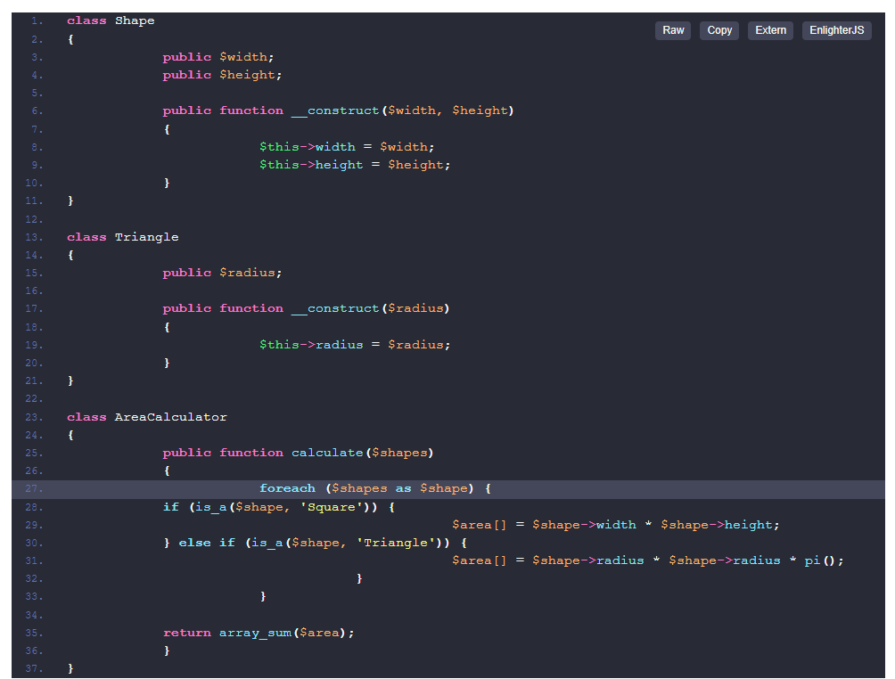

# Senior
## Общие вопросы

1. [Как вы понимаете REST?](https://medium.com/@andr.ivas12/rest-простым-языком-90a0bca0bc78)
2. [Что такое Copy-on-write?](https://www.google.com/url?sa=t&rct=j&q=&esrc=s&source=web&cd=&ved=2ahUKEwjE0IPyy5n4AhUN7XMBHRssDqwQFnoECAoQAQ&url=https%3A%2F%2Fzualex.com%2Fposts%2Fcopy-on-write-php%2F&usg=AOvVaw1GXKL7esbexeJgby8gaQY1)
3. [Что такое позднее статическое связывание?](https://ithazard.com/позднее-статическое-связывание/)
4. [Что такое CQRS?](https://www.google.com/url?sa=t&rct=j&q=&esrc=s&source=web&cd=&cad=rja&uact=8&ved=2ahUKEwjkzfWZzJn4AhVH7XMBHZMzAjQQFnoECBAQAQ&url=https%3A%2F%2Fhabr.com%2Fru%2Fcompany%2Fsimbirsoft%2Fblog%2F329970%2F&usg=AOvVaw0mCr9Ns-ToYNxvKDKDP-XI)
5. [Что такое cohesion и coupling?](https://www.google.com/url?sa=t&rct=j&q=&esrc=s&source=web&cd=&cad=rja&uact=8&ved=2ahUKEwjAyqOmzJn4AhVw7HMBHUvgDNgQFnoECAcQAQ&url=https%3A%2F%2Fmedium.com%2Fgerman-gorelkin%2Flow-coupling-high-cohesion-d36369fb1be9&usg=AOvVaw3S9ol33lo2OioWfK2ci1DK)
6. [Как можно получить значение частного свойства класса в рантайме?](https://www.google.com/url?sa=t&rct=j&q=&esrc=s&source=web&cd=&cad=rja&uact=8&ved=2ahUKEwikuq21zJn4AhX18XMBHd2ICCIQFnoECAkQAQ&url=https%3A%2F%2Fhabr.com%2Fru%2Fpost%2F186718%2F&usg=AOvVaw3NV5_fCgykksuGjybn7DzN)
7. [Как можно получить значение частного свойства класса в рантайме без использования рефлексии?](https://codernet.ru/articles/web/kak_poluchit_zashhishhennoe_svojstvo_obekta_v_php/)
8. [Стоит ли использовать в методах значение по умолчанию null? Если нет, то почему?](https://habr.com/ru/post/309462/)
9. [Стоит ли возвращать null из методов? Если нет, то почему и как писать код в таких случаях?](https://ask-dev.ru/info/19426/should-functions-return-null-or-an-empty-object)
10. [Стоит ли передавать null как параметр методов? Если нет, то почему и как писать код?](https://ru.stackoverflow.com/questions/1005521/Корректность-null-как-дефолтного-параметра-метода-и-возвращаемого-значения)
11. [Как вы понимаете Special Case / Null Object и где его следует применять?](https://habr.com/ru/post/169827/)
12. [Какой подход следует применить во время тестирования кода, имеющего внешние зависимости (например, обращение к API Google)?]()
13. [Что такое DDD?](https://promdevelop.com/technologies/domain-driven-design/)
14. [Что такое микросервисная архитектура?](https://vc.ru/dev/295980-mikroservisnaya-arhitektura-teoriya-i-praktika)
15. [Какие есть способы коммуникации между микросервисамы?](https://otus.ru/nest/post/2485/)
16. [Расскажите о ReactPHP или Swoole.](https://habr.com/ru/post/451916/)
17. [Что такое фильтр Блума?](https://habr.com/ru/company/otus/blog/541378/)
18. [Что такое gap locks в MySQL?](https://habr.com/ru/post/238513/)
19. [Зачем нужно кэширование? Какую проблему оно решает?](https://aws.amazon.com/ru/caching/)
20. [Какие виды кеш-хранилищ вы знаете и применяли? Чем они отличаются?]()
21. [Чем характеризуется эффективность кэширования?](https://intellect.icu/urovni-i-vidy-keshirovaniya-kogda-primenyat-i-kogda-keshirovanie-vredno-6961)
22. [Приведите сложный пример кэширования на практике.](https://compendium.school/informatics/algorithm/20.html)
23. [Что такое sensitive данные? Как хранятся в базе? Как отражаются в логах?](https://interlegal.com.ua/ru/publikacii/gdpr_novyj_uroven_zashhity_personalnyh_dannyh/)
24. [Коротко расскажите об истории PHP. Что появлялось в каждой версии? Куда развивается PHP на ваш взгляд? Что нового в последней версии?](https://www.php.net/manual/ru/history.php.php)
25. [Как в PHP очистить память?](https://codernet.ru/articles/web/chto_luchshe_ispolzovat_pri_osvobozhdenii_pamyati_v_php_unset_ili_$varnull/)
26. [Что такое антипаттерны? Приведите несколько примеров.](https://bool.dev/blog/detail/antipatterny-v-programmirovanii-i-proektirovanii-arkhitektury)
27. [Как сделать рефакторинг большого legacy-проекта? Как это аргументировать / продать PM-у, заказчику?](https://dou.ua/lenta/articles/legacy-system/)
28. [Чем отличается Dependency Injection от Service Locator?](https://habr.com/ru/post/465395/)
29. [Расскажите об утечке памяти в PHP. Приведите примеры. Как боролись?](https://youtu.be/NNMp-97rk9c)
30. [Как работает Garbage Collector? Когда есть смысл вызвать?](https://dou.ua/lenta/articles/principles-of-garbage-collection/)
31. [По какому принципу будете выбирать архитектуру для своей будущей программы?](https://habr.com/ru/post/276593/)
32. [С какими видами архитектуры приложений сталкивались?](https://nuancesprog.ru/p/12019/)
33. [Структуры данных. Какие знаете, какие использовали на практике?](https://habr.com/ru/company/ruvds/blog/515258/)
34. [С какими еще видами API сталкивались? Какие были проблемы? Как решали?](https://www.mobidea.com/academy/ru/shto-takoe-api/)
35. [Как вы понимаете Exception flow в контексте PHP?](https://habr.com/ru/post/100137/)
36. [Расскажите об автоматических анализаторах кода PHP (Roundcube т.д.).](https://habr.com/ru/company/badoo/blog/426605/)
37. [Расскажите о Performance & профилировании PHP-кода (Xdebug, XHprof т.д.).](http://debian-help.ru/articles/xhprof-i-xdebug-profilirovanie-profiling-koda-php/)
38. Расскажите, как бы вы реализовали систему, когда есть много источников данных, возвращающих в различных форматах данные о пользователе. Есть получатели данных, выбирающие, из каких источников они хотят принимать данные API.
39. Расскажите о проекте, которым по-настоящему гордитесь. Какие технологически необычные решения вы применили для его успешной реализации?
40. Как вы организуете тестирование кода? Когда покрытие тестами нерационально? Были ли у вас такие проекты?

## Git

41. Как изменить только сообщение последнего коммита?
42. git rebase -i HEAD ~ 3 что делает эта команда и какие могут возникнуть проблемы при ее применении?
43. Зачем команда git bundle?
44. Какой командой можно влить коммит в текущую ветку?
45. Как выполнить склеивание коммитов?

## Базы данных

46. Какие структуры данных поддерживает Redis?
47. Что подразумевается под понятием «триггер» в SQL?
48. Какая разница между реляционными и нереляционными СУБД?
49. Какие NoSQL СУБД знаете?
50. Что такое ACID Compliance?
51. Что такое Views? Какие преимущества и недостатки?
52. Что такое уровни изоляции транзакций?
53. Что такое concurrent query?
54. Что такое кластерные индексы?
55. Как построить социальную сеть, которая выдержит нагрузки в 100 000 посетителей в онлайне и сможет предлагать в друзья пользователям, например, из Нью-Йорка, людей, живущих в этом городе. Данных много, работать система должна быстро. Как все хранить? По какому принципу строить запросы?

## Практические задания

56. Какой принцип нарушен в коде и как можно исправить код?

57. Есть массив из 10 млн. уникальных строк. Программа получает новую строку, необходимо найти все строки из массива, удовлетворяющие критерию: расстояние Левенштейна до новой строки меньше 3 операций.

58. Нужно построить сервер отсылки емейлов. Какие классы / слои / абстракции вы бы выделили?

59. Как бы вы реализовали сокращалку урлов, сжиматель / разжиматель изображений, парсер последних сообщений форума, где упоминается определенный бренд, проверку цен на товары у конкурентов?
    

